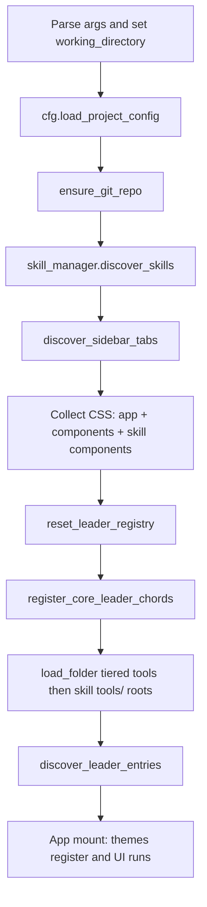

# Extending Cody

How to add behavior, agent capabilities, and UI without forking core code. For a module-by-module map of [`utils/`](../utils/), see [utils_reference.md](utils_reference.md).

## Quick decisions

| Goal | Prefer | Why |
|------|--------|-----|
| Specialized instructions + optional scripts | **Skills** (`SKILL.md`) | Loaded progressively via `activate_skill` / `run_skill`; keeps the default tool surface small. |
| Always-on LLM function the model can call every turn | **Tools** (`.py` in tiered `tools/`) | Bypasses progressive skill loading; use sparingly (docstrings matter for schemas). |
| User-triggered chat actions (`/foo`) | **Slash commands** (`CommandBase` in `$CODY_DIR/cmd/` and optional `<skill-dir>/cmd/`) | Chat-local UX, not necessarily exposed as LLM tools. |
| Extra sidebar tab or leader-menu chords for a skill | **Skill hooks** (`components/sidebar_tab.py`, `components/leader_menu.py`, optional CSS) | Discovered from the skill’s directory; no edit to `main.py`. |
| Look and feel | **Themes** (`.py` in tiered `themes/`) | `discover_themes()` + `theme` export. |
| Encrypted user secrets (passwords, API keys, notes) | **[`utils/password_vault.py`](../utils/password_vault.py)** | Procedures: [password_vault.md](password_vault.md). |

Bundled examples: [examples/README.md](../examples/README.md) (`examples/skills/` including skill `cmd/`, `examples/component/`).

## Tiered paths (default order)

Later directories **override** earlier ones for the same **file/module name** where applicable.

| Resource | Order (first → last, last wins) |
|----------|----------------------------------|
| **Skills** | `$CODY_DIR/skills/` → `~/.agents/skills/` → `{project}/.agents/skills/` |
| **Tools** | `$CODY_DIR/tools/` → `~/.agents/tools/` → `{project}/.agents/tools/` |
| **Skill tools** | Each enabled skill’s `<skill-dir>/tools/` in the **same** skills tier order as `cmd/` (folders sorted by name per tier). Loaded right after tiered `tools/` via [`skill_tools_directory_paths`](../utils/skills.py). |
| **Slash commands** | `$CODY_DIR/cmd/`, then each enabled skill’s `<skill-dir>/cmd/` in **skills tier order** (`$CODY_DIR/skills/` → `~/.agents/skills/` → `{project}/.agents/skills/`), folders sorted by name within each tier (later wins for same module name). Optional extra dirs via `commands.directories` (resolved **before** skill `cmd/` dirs). |
| **Themes** | `$CODY_DIR/themes/` → `~/.agents/cody_themes/` (legacy) → `~/.agents/themes/` → `{project}/.agents/themes/` |

Override search lists in JSON config:

- `skills.directories` — list of templates (see [`utils/paths.py`](../utils/paths.py) `tiered_dir_templates` / `resolve_dir_templates`).
- `commands.directories` — optional list of extra command dirs (templates); default is `["$CODY_DIR/cmd"]` from [`utils/paths.py`](../utils/paths.py) `default_command_directory_templates()`. [`utils/cmd_loader.py`](../utils/cmd_loader.py) `load_commands()` always appends discovered [`skill_command_directory_paths`](../utils/skills.py) after that list.

**Bundled sub-agents:** JSON files under `$CODY_DIR/skills/agents/bundled/` (path from [`bundled_agent_definitions_dir()`](../utils/paths.py)) are seeded into the `agents` table on init when no row exists with the same `name`. Use this to ship example sub-agents with the repo.

**Slash commands migration:** If you used flat `~/.agents/commands/` or `{project}/.agents/commands/`, move each `CommandBase` module into a skill folder as `<skills-tier>/<skill-name>/cmd/*.py` (with a valid `SKILL.md` beside it), or add your old path explicitly to `commands.directories`.

## Startup order (what loads when)

Relevant sequence from [`main.py`](../main.py) (simplified):

- **Tools** import runs at step **I**; `register_tool(...)` calls should run at module import time.
- **Skill leader menus** run at **J**; they can add chords after core registration (**H**).

## Extension types (detail)

| What | Where (default tiers) | Contract | Loaded by | Notes |
|------|------------------------|----------|-----------|-------|
| Skill | `<skill-dir>/SKILL.md` (+ optional `config.json`, `scripts/`) | YAML frontmatter: `name`, `description`; markdown body | [`utils/skills.py`](../utils/skills.py) `SkillManager.discover_skills` | Optional per-skill enable map: `skills.enabled` in config. |
| Skill sidebar tab | `<skill-dir>/components/sidebar_tab.py` | `sidebar_label: str`; `get_sidebar_widget()` or `SidebarWidget` class; optional `sidebar_tooltip` | [`utils/skill_components.py`](../utils/skill_components.py) `discover_sidebar_tabs` | |
| Skill leader menu | `<skill-dir>/components/leader_menu.py` | `def register_leader(reg):` using `reg.add_submenu` / `reg.add_action` | [`utils/leader_registry.py`](../utils/leader_registry.py) `discover_leader_entries` | |
| Skill CSS | `<skill-dir>/components/**/*.css` | Valid Textual CSS | [`main.py`](../main.py) merges paths after scanning `components/` | Walks only `components/` under the skill. |
| Agent tool | Tiered `tools/**/*.py` | At import: `register_tool("name", fn, tags=[...])`; callable needs usable docstring for OpenAI schema | [`utils/fs.py`](../utils/fs.py) `load_folder` from [`main.py`](../main.py) | Passed to the model when enabled; favor skills for heavy guidance. |
| Skill tool | `<skill-dir>/tools/**/*.py` | Same contract as tiered tools; `register_tool` at import | [`utils/fs.py`](../utils/fs.py) `load_folder` on each path from [`skill_tools_directory_paths`](../utils/skills.py) in [`main.py`](../main.py) (and [`skills/agents/scripts/run_agent.py`](../skills/agents/scripts/run_agent.py)) | Keeps tools next to the skill; respects `skills.enabled`. |
| Slash command | `$CODY_DIR/cmd/` + optional `<skill-dir>/cmd/` (see tier table); optional extra dirs via `commands.directories` | One subclass of `CommandBase` per module (`async def execute(self, app, args)`) | [`utils/cmd_loader.py`](../utils/cmd_loader.py) `load_commands` | Module filename → command name (first `CommandBase` wins in file). |
| Theme | Tiered `themes/*.py` | Module attribute `theme` (Textual theme object with `.name`) | [`utils/theme_man.py`](../utils/theme_man.py) `discover_themes` | Theme dirs from `resolved_theme_paths()` in [`utils/paths.py`](../utils/paths.py). |

## Slash commands: preview then add to chat

For commands that **inject text into the transcript**, prefer a **read-only preview** so the user can cancel before the chat changes:

1. Build the payload string (plain or markdown).
2. `await preview_then_append_chat_message(app, title, body, role="system")` from [`components/utils/input_modal.py`](../components/utils/input_modal.py) — opens `PreviewToChatModal` (**Add to chat** / **Cancel**), truncates very long bodies, and on confirm appends to the active tab’s `actor.msg`, refreshes `messages`, and `save_chat()`s.
3. Use `role="assistant"` only when the content should appear as an assistant turn (e.g. sub-agent output).

Core `/help` and `/clear` may keep their existing behavior. Extend [`InputModal`](../components/utils/input_modal.py) in the same module if you need new modal variants; reuse `Vertical` / `Horizontal` / `ActionButton` / `.modal-button-container` patterns and [`input_modal.css`](../components/utils/input_modal.css).

Dismiss callback pattern (also used in [`components/chat/chat.py`](../components/chat/chat.py) for `InputModal`): `loop = asyncio.get_running_loop()`, `fut = loop.create_future()`, `app.push_screen(modal, lambda r: loop.call_soon_threadsafe(fut.set_result, r))`, then `await fut`.

## Config files

- Global: `~/.agents/cody_settings.json` (full merged state when saved from the app while this is the top layer)
- Project: `{project}/.agents/cody_config.json` (merged on top; **save writes only overrides** vs global + any earlier paths — see [`cfg_man.py`](../utils/cfg_man.py))
- Built-in defaults: `register_default_config` + `cfg.apply_registered_defaults()` after `load_project_config`

Provider keys (among others): `session.provider`, `providers.<name>.model`, `providers.<name>.opts`.

## Password vault

Unlock, register, read, and delete encrypted credentials and notes: **[password_vault.md](password_vault.md)**. Core API: [`utils/password_vault.py`](../utils/password_vault.py). Skills that store secrets should keep them in the vault and register a session clear hook via **`register_vault_session_clear_hook`** when they cache decrypted material so locking the vault clears skill-side caches.

## Core code changes

If something cannot be done via skills, tools, commands, or themes, the next layer is Python under [`components/`](../components/) or [`utils/`](../utils/). Prefer extending existing discovery hooks over hard-coding paths in `main.py` so user and project tiers keep working.
