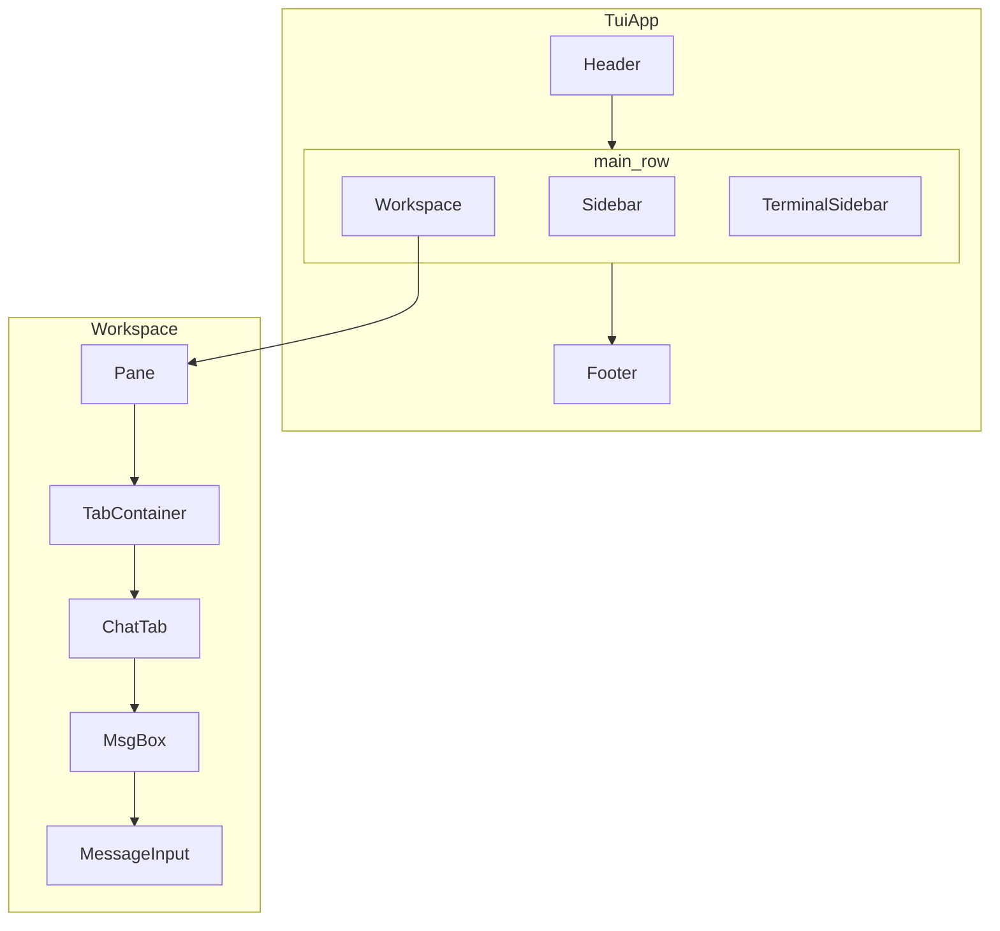

# Cody: informational flow

This document traces how configuration, user input, LLM traffic, tools, and persistence move through Cody from process start until exit. It complements [utils_reference.md](utils_reference.md) (API-style detail) with a single narrative path through the codebase.

## Overview

Cody is a [Textual](https://textual.textualize.io/) terminal application. A global [`cfg`](../utils/cfg_man.py) object merges tiered JSON settings; SQLite in the project `.agents` directory holds chats, input history, agents metadata, and more; skills extend the app with `SKILL.md` discovery, optional slash commands, model tools, sidebar tabs, and CSS. The chat path keeps canonical conversation state on an [`Agent`](../utils/agent.py) (`actor.msg`) while the UI mirrors a filtered, grouped view in [`MsgBox.messages`](../components/chat/chat.py).

## Startup sequence

1. **[main.py](../main.py)** parses `working_directory` (default `.` → `os.getcwd()`).
2. **`cfg.load_project_config(working_directory)`** adds `{working_directory}/.agents/cody_config.json` to the config path list and merges it. **`cfg.apply_registered_defaults()`** fills missing keys from every module that called `register_default_config` during import.
3. **`cfg.set('session.working_directory', ...)`** records the session cwd (and triggers a config save when values change).
4. **Side-effect imports** run before the UI: [`utils.providers`](../utils/providers/__init__.py), [`utils.agent`](../utils/agent.py), [`utils.skills`](../utils/skills.py), [`utils.cmd_loader`](../utils/cmd_loader.py), [`utils.db`](../utils/db.py), [`utils.interface_defaults`](../utils/interface_defaults.py), [`utils.file_tree_defaults`](../utils/file_tree_defaults.py) — each may register default config fragments.
5. **`ensure_git_repo(working_directory)`** ([utils/git.py](../utils/git.py)) ensures a usable git context where applicable.
6. **`skill_manager.discover_skills()`** scans tiered skill directories ([utils/skills.py](../utils/skills.py)), respecting `skills.enabled`, and builds the in-memory skill catalog used for prompts and discovery.
7. **Leader key registry**: `reset_leader_registry()`, `register_core_leader_chords()` ([utils/leader_registry.py](../utils/leader_registry.py)).
8. **Tool modules**: [`fs.load_folder`](../utils/fs.py) imports every `.py` under tiered `tools/` paths and each enabled skill’s `tools/` directory. Those modules typically call `register_tool` ([utils/tool.py](../utils/tool.py)) so the model can invoke them.
9. **`discover_leader_entries()`** picks up leader-menu registrations from loaded code (e.g. skill-provided chords).
10. **`asyncio.run(main())`** constructs **`TuiApp`**, sets the window title from `cfg`, runs **`await app.run_async()`**, and in a **`finally`** block always runs **`await app.cleanup()`** after the Textual loop ends.

## UI tree

`TuiApp.compose` ([main.py](../main.py)) yields:

- A vertical **app body**: **Header**, a horizontal **main row**, **Footer**.
- **main row**: [`Sidebar`](../components/sidebar/wrapper.py) (`#util-sidebar`), [`Workspace`](../components/workspace/workspace.py) (`#workspace`), [`TerminalSidebar`](../components/terminal/terminal_sidebar.py) (`#term-sidebar`).

`TuiApp.on_mount` initializes the password vault against the app ([utils/password_vault.py](../utils/password_vault.py)), registers themes from [`discover_themes`](../utils/theme_man.py), applies `cfg`’s theme, then **`await action_new_chat_tab()`** so the workspace opens with an initial [`ChatTab`](../components/chat/chat.py).

**Sidebar** tabs ([components/sidebar/wrapper.py](../components/sidebar/wrapper.py)): chat history, file tree, tool list, DB connections, password vault, dynamically discovered skill sidebar tabs ([utils/skill_components.py](../utils/skill_components.py)), and settings.

**Workspace** holds one or more **Pane** widgets; each pane has a **TabContainer** for editor/chat tabs. Visibility of sidebars is toggled via `action_toggle_visible` and a `visibility` dict in [main.py](../main.py).

## Chat and LLM round-trip

### Tab construction

- **`ChatTab.compose`** creates an **`Agent()`**: system prompt from `cfg`, `{working_directory}` substitution, plus an XML skills catalog from `skill_manager.get_catalog_xml()` when skills exist ([utils/agent.py](../utils/agent.py)).
- If the tab was opened from history, **`chat_data`** replaces `actor.msg` before the UI is built.
- **`MsgBox`** holds **`actor`**, **`config`**, **`chat_id`**, and reactive **`messages`** derived from `actor.msg` (optionally hiding `system` role per `interface.show_system_messages`).

### From keystroke to provider

1. User types in **`MessageInput`** ([components/chat/input.py](../components/chat/input.py)).
2. **Slash commands** (`/name …`): resolved via **`load_commands()`** ([utils/cmd_loader.py](../utils/cmd_loader.py)) from `commands.directories` and each enabled skill’s `cmd/`. Submit runs **`app.run_worker(cmd.execute(self.app, args))`** — no LLM.
3. **Normal message**:
   - **`@file`** references expand to fenced file contents appended to both display text and text sent to the model (the model-facing string strips `@…` tokens but keeps the appended blocks).
   - Optional **git checkpoint** via `create_checkpoint` ([utils/git.py](../utils/git.py)); stored on the user message as `git_checkpoint` for UI.
   - New user row + a **“Thinking…”** assistant placeholder are appended to **`MsgBox.messages`**; a worker runs **`MsgBox.get_agent_response`** ([components/chat/chat.py](../components/chat/chat.py)).

4. **`get_agent_response`**:
   - For OpenAI, may require vault/UI flow via **`ensure_openai_api_key_for_tui`** ([utils/providers/openai_vault.py](../utils/providers/openai_vault.py)).
   - Appends the user message to **`actor.msg`** (the full chat history the provider sees).
   - Loop until no tool calls:
     - **`asyncio.to_thread(self.actor.get_response, "")`** → **`Agent.get_response`** uses **`get_tools(['skills','system'])`**, **`get_provider()`** / **`get_provider_config()`** ([utils/providers/__init__.py](../utils/providers/__init__.py)), then **`provider.chat(model, messages, tools, options)`**.
     - If the model returns **tool calls**, each is handled (for **`run_command`**, a confirm modal runs on the UI thread before **`execute_tool`**). Results are JSON tool payloads appended as **`role: tool`** on **`actor.msg`**, with UI refresh via **`_sync_messages_from_actor`**.
   - On completion: **`save_chat`** → **`db_manager.save_chat`**, then **`ChatHistoryTab.load_chats()`** if present.

Canonical **thread for the model** is **`actor.msg`**. **`MsgBox.messages`** is a UI-aligned copy (grouped blocks, loading placeholder, optional hiding of system/tool presentation).

## Commands, skills, and tools

| Mechanism | Purpose | Loaded from |
|-----------|---------|-------------|
| **Slash commands** | User-initiated `/foo`; async `CommandBase.execute(app, args)` | [utils/cmd_loader.py](../utils/cmd_loader.py), repo `cmd/`, skill `cmd/` |
| **Model tools** | LLM invokes registered Python callables; grouped as `skills`, `system`, etc. | [utils/tool.py](../utils/tool.py); `tools/` + skill `tools/` via [utils/fs.py](../utils/fs.py) |
| **Skills catalog** | Short descriptions in system prompt; full body via **`activate_skill`** tool | [utils/skills.py](../utils/skills.py), [tools/skills/activate_skill.py](../tools/skills/activate_skill.py) |
| **Skill sidebar tabs** | Extra `TabPane` widgets | [utils/skill_components.py](../utils/skill_components.py) (`components/sidebar_tab.py` per skill) |

**Leader menu** ([components/utils/leader_guide_screen.py](../components/utils/leader_guide_screen.py), [utils/leader_registry.py](../utils/leader_registry.py)): core chords plus discovered entries; chat-related entries come from **`register_leader_chords`** in [components/chat/chat.py](../components/chat/chat.py).

## Persistence

| Data | Location | Access |
|------|----------|--------|
| Merged settings (global + project) | `~/.agents/cody_settings.json`, `{session_cwd}/.agents/cody_config.json` | [utils/cfg_man.py](../utils/cfg_man.py) `cfg`; **`cfg.set`** writes an overlay diff to the project config path |
| Chats, input history, agents rows, todos, … | `{Cody_app}/.agents/cody_data.db` where **`get_cody_dir()`** is the Cody checkout / install root ([utils/paths.py](../utils/paths.py)) | [utils/db.py](../utils/db.py) **`db_manager`** (lazy singleton behind **`_DbManagerProxy`**). Chat rows are keyed by **`working_directory`** so multiple project sessions share one DB file. |
| Git checkpoints | Git repo under **`session.working_directory`** | [utils/git.py](../utils/git.py) |

First touch of **`db_manager`** constructs **`DatabaseManager`**, migrates legacy `{Cody_app}/.cody/data.db` if needed, ensures tables, and seeds bundled agent definitions from [skills/agents/bundled/](../skills/agents/bundled/).

## Other user → app flows

- **Chat history** ([components/sidebar/chat_history.py](../components/sidebar/chat_history.py)): **`ChatSelected`** on **`TuiApp`** loads a chat with **`db_manager.get_chat`** or opens a blank **`ChatTab`**, focusing an existing tab if the **`chat_id`** is already open ([main.py](../main.py)).
- **Send terminal to chat** ([main.py](../main.py) **`trigger_send_terminal`**): reads terminal buffer, optional prompt via **`InputModal`**, then the same **`get_agent_response`** worker path as the chat input.

## Shutdown and cleanup

When the user quits (or the app exits for any reason after **`run_async`** returns), **`TuiApp.cleanup`** ([main.py](../main.py)):

1. Finds **`Workspace`**, iterates **`MsgBox`** children, **`await msg_box.save_chat()`** (best effort, errors swallowed).
2. **`cfg.save()`** to persist config.
3. **`password_vault.init_vault(None)`** to release vault state tied to the app instance.

No separate signal handler is required for the common case: the **`finally`** in **`main()`** ensures **`cleanup`** runs after **`app.run_async()`**.
